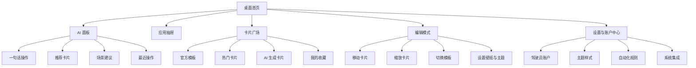

# 车机 AI 桌面页面结构草图与首页布局方案

## 1. 文档目标

本文基于现有需求文档，进一步给出可直接用于产品评审与视觉设计启动的页面结构草图和首页布局方案。

目标有三个：

1. 明确桌面产品的信息架构
2. 明确首页在不同场景下的布局重心
3. 为后续 UI 视觉设计和 Android 开发落地提供线框参考


## 2. 整体产品结构

建议将整套车机 AI 桌面拆分为 6 个核心页面层级：

1. 桌面首页
2. AI 面板
3. 应用抽屉
4. 卡片广场
5. 编辑模式
6. 设置与账户中心


## 3. 页面结构总览




## 4. 页面导航关系

建议采用“首页为核心，其他页面轻量弹出或侧滑进入”的结构，而不是传统多级页面跳转。

### 原则

1. 导航深度尽量不超过 2 层
2. 高价值操作尽量通过首页完成
3. AI、应用抽屉、编辑模式优先采用抽屉层或浮层
4. 驾驶态下禁止进入深层设置页


## 5. 首页布局总原则

首页建议采用“三段式布局骨架 + 卡片式内容编排”。

### 首页骨架

1. 顶部状态带
2. 中部主舞台区
3. 底部快捷与次要卡片区

### 首页内容组织原则

1. 只保留 1 个主任务焦点
2. 不把所有能力平均铺开
3. 导航与音乐必须在首屏可达
4. AI 入口必须稳定可见
5. 卡片数量控制在 4 到 6 个高价值单元


## 6. 首页布局方案 A，标准横屏 16:9

适用场景：1024x600、1280x720、1920x1080 等主流横屏车机

### 布局说明

1. 左侧为主任务区，优先给导航或 AI 场景卡片
2. 右侧为信息与快捷区，承载音乐、电话、天气、最近任务
3. 顶部为细状态带，避免侵占太多有效空间
4. 底部保留常驻快捷带

### 线框草图

```text
┌──────────────────────────────────────────────────────────────────────┐
│ 时间/天气/网络/蓝牙/账户                           AI 助手入口      │
├──────────────────────────────────────────────────────────────────────┤
│                                                                      │
│  ┌────────────────────────────────┐  ┌────────────────────────────┐  │
│  │                                │  │ 音乐卡片                   │  │
│  │          主导航卡片            │  │ 专辑图/播放/收藏/切换      │  │
│  │      回家/公司/最近目的地       │  ├────────────────────────────┤  │
│  │   路况/预计到达/一键发起导航     │  │ 电话/联系人卡片            │  │
│  │                                │  │ 最近联系人/一键拨号         │  │
│  │                                │  ├────────────────────────────┤  │
│  │                                │  │ 天气/车况/停车记录卡片      │  │
│  └────────────────────────────────┘  └────────────────────────────┘  │
│                                                                      │
├──────────────────────────────────────────────────────────────────────┤
│ 应用抽屉   音乐   地图   电话   任务场景   最近应用   编辑           │
└──────────────────────────────────────────────────────────────────────┘
```

### 适合的视觉方向

1. 主导航卡片作为首页绝对视觉中心
2. 音乐卡片使用封面和进度条提升情绪价值
3. 右侧小卡片控制信息密度，避免挤压主卡片


## 7. 首页布局方案 B，超宽屏双列主舞台

适用场景：1920x720、车内超宽中控屏、连屏式布局

### 布局说明

1. 中部采用双主卡片结构
2. 左主卡片承载导航或场景任务
3. 右主卡片承载音乐或 AI 推荐
4. 次级卡片下沉到底部短条区

### 线框草图

```text
┌──────────────────────────────────────────────────────────────────────────────┐
│ 时间      天气      网络      蓝牙      账户                  AI 助手入口    │
├──────────────────────────────────────────────────────────────────────────────┤
│                                                                              │
│  ┌──────────────────────────────┐  ┌──────────────────────────────────────┐  │
│  │ 导航主卡片                   │  │ 音乐/AI 主卡片                       │  │
│  │ 回家                         │  │ 推荐歌单 / AI 推荐动作               │  │
│  │ 预计 28 分钟                 │  │ 今日通勤建议 / 一句话创建卡片        │  │
│  │ 路况简报                     │  │ 媒体封面 / 快速操作                  │  │
│  │ 一键发起导航                 │  │                                      │  │
│  └──────────────────────────────┘  └──────────────────────────────────────┘  │
│                                                                              │
│  ┌────────────────┐ ┌────────────────┐ ┌────────────────┐ ┌──────────────┐ │
│  │ 最近联系人      │ │ 车况状态        │ │ 停车位置        │ │ 任务场景      │ │
│  └────────────────┘ └────────────────┘ └────────────────┘ └──────────────┘ │
│                                                                              │
├──────────────────────────────────────────────────────────────────────────────┤
│ 应用抽屉   电话   地图   音乐   收藏卡片   自动化   编辑                     │
└──────────────────────────────────────────────────────────────────────────────┘
```

### 适合的视觉方向

1. 超宽屏不要做成均分网格，否则视觉会散
2. 应用“双焦点”结构，但主副关系必须仍然明确
3. 底部卡片建议做成细长条形，降低压迫感


## 8. 首页布局方案 C，停车娱乐态首页

适用场景：挂 P 挡、驻车、休息或充电时

### 布局说明

1. 驾驶工具卡片退居次要位置
2. 中央可切换为媒体、视频、游戏、艺术屏保、AI 娱乐内容
3. 页面氛围允许更沉浸、更柔和

### 线框草图

```text
┌──────────────────────────────────────────────────────────────────────┐
│ 时间/天气/网络/账户                              AI 娱乐入口         │
├──────────────────────────────────────────────────────────────────────┤
│                                                                      │
│  ┌──────────────────────────────────────────────────────────────┐    │
│  │                      娱乐主舞台卡片                           │    │
│  │                视频 / 音乐 / 艺术相框 / 游戏                  │    │
│  │              推荐内容 + AI 生成屏保 + 最近继续                │    │
│  └──────────────────────────────────────────────────────────────┘    │
│                                                                      │
│  ┌────────────────┐ ┌────────────────┐ ┌──────────────────────────┐ │
│  │ 最近导航        │ │ 车况摘要        │ │ NAS / 本地媒体 / 收藏夹   │ │
│  └────────────────┘ └────────────────┘ └──────────────────────────┘ │
│                                                                      │
├──────────────────────────────────────────────────────────────────────┤
│ 地图   音乐   视频   游戏   艺术屏保   应用抽屉   编辑               │
└──────────────────────────────────────────────────────────────────────┘
```

### 适合的视觉方向

1. 停车态可以强化背景氛围和媒体封面表达
2. 驾驶相关信息仍保留，但不再占据视觉中心
3. 支持轻动态背景和 AI 屏保切换


## 9. 顶部状态带设计建议

顶部状态带要做到“信息全，但存在感低”。

### 建议包含元素

1. 时间
2. 天气与温度
3. 网络状态
4. 蓝牙状态
5. 账户头像或驾驶员标识
6. AI 助手入口

### 设计原则

1. 高度薄，不抢主内容焦点
2. 图标统一细线面风格
3. 仅重要状态常驻，其他进入二级面板


## 10. 底部快捷带设计建议

底部快捷带建议承担“稳定入口”的职责。

### 必备入口

1. 应用抽屉
2. 地图
3. 音乐
4. 电话
5. 场景任务
6. 编辑

### 原则

1. 入口个数控制在 5 到 7 个
2. 图标尺寸足够大，支持驾驶中盲操作
3. 驾驶态下位置固定，不允许用户任意删除核心入口


## 11. AI 面板草图

AI 面板建议从右侧滑出，避免完全打断当前桌面上下文。

### 线框草图

```text
┌──────────────────────────────────────────────────────────────┐
│ AI 助手                                                      │
├──────────────────────────────────────────────────────────────┤
│ 你可以这样说                                                 │
│ 帮我创建一个下班回家桌面                                      │
│ 把音乐卡片放到首页                                            │
│ 停车时显示视频和游戏                                          │
├──────────────────────────────────────────────────────────────┤
│ 推荐操作                                                     │
│ 1. 创建通勤卡组                                               │
│ 2. 添加最近联系人卡片                                         │
│ 3. 切换夜间主题                                               │
├──────────────────────────────────────────────────────────────┤
│ 最近操作                                                     │
│ 已将导航卡片移动到首页                                        │
│ 已创建“接娃模式”场景                                          │
├──────────────────────────────────────────────────────────────┤
│ 语音输入 / 文本输入 / 执行                                    │
└──────────────────────────────────────────────────────────────┘
```

### 设计重点

1. AI 面板必须服务操作，不应做成聊天工具页
2. 结果应尽量卡片化展示
3. 一条指令尽量直接对应一个可执行结果


## 12. 应用抽屉草图

建议应用抽屉采用“分类 + 常用优先”的双层结构。

### 线框草图

```text
┌──────────────────────────────────────────────────────────────┐
│ 搜索应用                                                     │
├──────────────────────────────────────────────────────────────┤
│ 常用  导航出行  音乐电台  通讯  娱乐  工具  系统              │
├──────────────────────────────────────────────────────────────┤
│  高德地图    QQ音乐    电话    蓝牙音乐    哔哩哔哩           │
│  网易云      酷狗      微信读书  播客        车况工具         │
│  ...                                                         │
└──────────────────────────────────────────────────────────────┘
```

### 设计重点

1. 常用应用要优先于全部应用
2. 驾驶态只显示安全相关分类
3. 停车态开放娱乐类应用


## 13. 编辑模式草图

编辑模式建议采用“长按进入 + 卡片浮起 + 底部工具条”的轻编辑方式。

### 线框草图

```text
┌──────────────────────────────────────────────────────────────────────┐
│ 编辑模式                                             完成/取消       │
├──────────────────────────────────────────────────────────────────────┤
│                                                                      │
│   [卡片轻微浮起，可拖拽，可换位，可缩放]                              │
│                                                                      │
│   ┌──────────────┐    ┌──────────────┐    ┌──────────────┐           │
│   │ 导航卡片      │    │ 音乐卡片      │    │ 电话卡片      │           │
│   └──────────────┘    └──────────────┘    └──────────────┘           │
│                                                                      │
├──────────────────────────────────────────────────────────────────────┤
│ 添加卡片   换模板   改主题   锁定布局   删除                           │
└──────────────────────────────────────────────────────────────────────┘
```

### 设计重点

1. 编辑反馈要清晰，但动画要克制
2. 核心驾驶入口不可被误删
3. Android 4.4 上编辑模式要避免复杂实时阴影和模糊特效


## 14. 推荐的首页卡片优先级

### 驾驶态

1. 导航主卡片
2. 音乐控制卡片
3. 电话或最近联系人卡片
4. 天气和车况摘要卡片
5. AI 快捷场景卡片

### 通勤态

1. 回家或去公司导航卡片
2. 今日路况与 ETA 卡片
3. 最近播客或音乐卡片
4. 快捷联系人卡片
5. 停车位置记录卡片

### 停车态

1. 媒体主舞台卡片
2. 娱乐应用卡片
3. 艺术屏保或 AI 内容卡片
4. NAS / 本地媒体卡片
5. 车况摘要卡片


## 15. 视觉落地方向建议

如果要做得比当前常见量产桌面更好看，首页建议遵循以下落地方向：

1. 只保留一个最强视觉焦点，不做平均分配网格
2. 背景使用轻层次渐变或虚化氛围，不用纯黑平铺
3. 卡片之间通过留白区分层级，而不是靠粗边框分隔
4. 音乐和导航卡片要有内容封面感，而不是工具面板感
5. 停车态切换时，首页的情绪氛围应该明显变化


## 16. 适合直接进入视觉设计阶段的输出清单

下一步如果进入 UI 设计，可直接基于本文继续产出：

1. 首页高保真视觉稿，标准横屏版
2. 首页高保真视觉稿，超宽屏版
3. 停车娱乐态视觉稿
4. AI 面板视觉稿
5. 编辑模式视觉稿
6. 卡片组件设计规范
7. 色板、字体、间距和动效规范